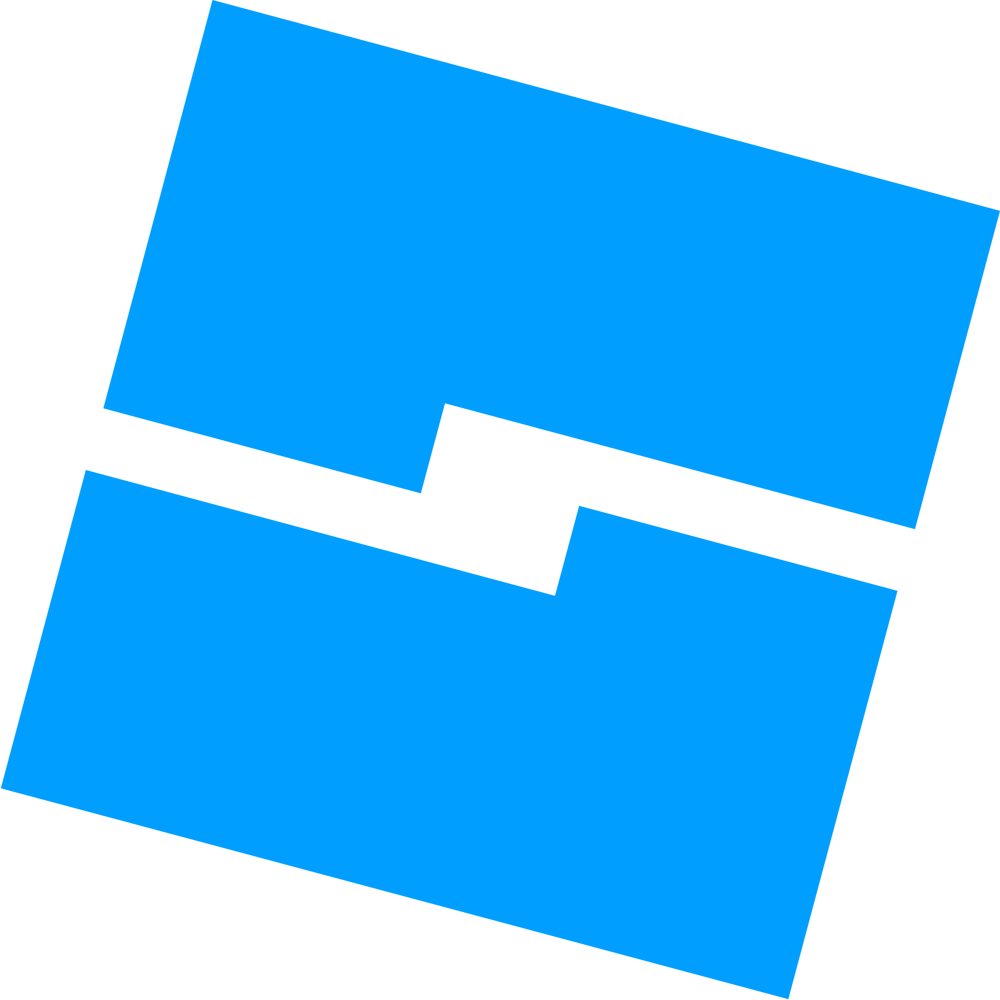

<h1 align="center">
  
</h1>

<h5 align="center">
  <code><a href="https://www.linkedin.com/in/ /" title="LinkedIn Profile"> LinkedIn</a></code>
  <code><a href="https://www.instagram.com/ /" title="Instagram Profile"> Instagram</a></code>
</h5>
 

  Hi, I'm Sergen, Computer Engineer student from Turkey
   
   
  📖 I'm currently studying for Computer Engineering
   
  💻 I love writing code

 
<h2 align="center">💻 Languages & Programs 💻</h2>
 

  <code></code>
  <code></code>
  <code></code>
   
  <code></code>
  <code></code>
  <code></code>
    
  <code></code>
  <code></code>
   
  <code></code>
  <code></code>
   
  <code></code>
  <code></code>

